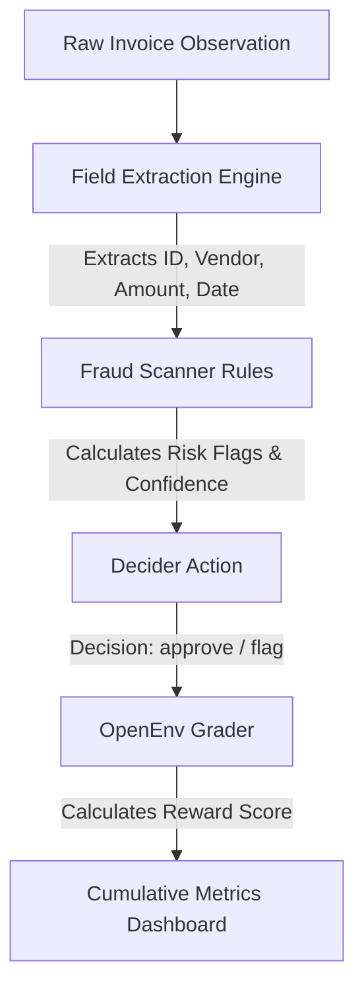

# 🛡️ InvoiceGuard AI: Fraud Detection Agent

> **An OpenEnv-compatible intelligent agent system designed for automated accounts payable processing and invoice fraud detection.**

---

<div align="center">

[](https://github.com/)
[](https://python.org/)
[](https://streamlit.io/)
[](LICENSE)

</div>

---

## 🌌 Overview

**InvoiceGuard AI** is a lightweight, fully offline intelligent agent system built to parse raw/OCR-scanned invoice text, extract critical fields, perform multi-criteria fraud analysis, and make decisions to either **Approve** or **Flag** invoices.

Using an **OpenEnv-style** simulator interface (inspired by OpenAI Gym), this project demonstrates core Agentic AI patterns:
1. **Observation-Action-Reward Loop**: A formal environment evaluates agent actions and issues granular rewards.
2. **Deterministic & Rule-Based Heuristics**: Highly testable parsing and detection baselines.
3. **Synthetic Dataset Generation**: Integrated Faker generators simulating hundreds of diverse invoice layouts (normal vs. fraudulent).

---

## 🛠️ Technology Stack

* **Language**: Python 3.8+
* **Interface**: Streamlit (with Plotly Express charts & Pandas tables)
* **Data Processing**: SQLite3 (local historical database log), Regex Engine
* **Mocking Utility**: Faker library (generates custom names, dates, companies)
* **Design/CSS**: Dark Theme Web UI with status cards and download utilities

---

## 📂 Project Directory Structure

| File | Purpose |
| :--- | :--- |
| **[`agent.py`](file:///c:/Users/agfdg/OneDrive/Desktop/git%20repo/Invoice_Processing-Fraud_Detection/agent.py)** | Contains the `InvoiceAgent` class: parses values (regex), analyzes fraud indicators, and returns actions. |
| **[`env.py`](file:///c:/Users/agfdg/OneDrive/Desktop/git%20repo/Invoice_Processing-Fraud_Detection/env.py)** | Implements `InvoiceEnv`, an OpenEnv environment that tracks step state and assigns rewards. |
| **[`tasks.py`](file:///c:/Users/agfdg/OneDrive/Desktop/git%20repo/Invoice_Processing-Fraud_Detection/tasks.py)** | Utility to generate clean & fraudulent synthetic invoice tasks. |
| **[`streamlit_app .py`](file:///c:/Users/agfdg/OneDrive/Desktop/git%20repo/Invoice_Processing-Fraud_Detection/streamlit_app%20.py)** | Fully featured interactive dashboard with charts, evaluation loops, and custom inputs. |
| **[`baseline.py`](file:///c:/Users/agfdg/OneDrive/Desktop/git%20repo/Invoice_Processing-Fraud_Detection/baseline.py)** | Command line script executing evaluation across 100 sample tasks. |
| **[`predict.py`](file:///c:/Users/agfdg/OneDrive/Desktop/git%20repo/Invoice_Processing-Fraud_Detection/predict.py)** | Command line prediction script running the agent on individual test inputs. |
| **[`data_generator.py`](file:///c:/Users/agfdg/OneDrive/Desktop/git%20repo/Invoice_Processing-Fraud_Detection/data_generator.py)** | Supporting dataset utility. |
| **[`grader.py`](file:///c:/Users/agfdg/OneDrive/Desktop/git%20repo/Invoice_Processing-Fraud_Detection/grader.py)** | Automated grader checking task execution metrics. |
| **`invoices.db`** | Local SQLite database recording system histories. |

---

## 🎯 Agentic Workflow & Reward Matrix

The agent processes incoming data through a formal execution pipeline:



### Reward Criteria (Max 1.0 Point per Invoice)
* **Field Extraction Accuracy**: `+0.2` if extracted IDs, vendors, and amounts match ground truth.
* **Fraud Detection Match**: `+0.3` if fraud labels are correctly flagged.
* **Decision Match**: `+0.5` if the final action matches the target decision; `-0.5` penalty if it differs.

---

## ⚡ Quick Start

### ⚙️ Installation
Ensure you have Python 3.8+ installed, then install dependencies:
```bash
pip install -r requirements.txt
```

### 🏃 Running the Application

#### A. Interactive Streamlit Web Interface (Recommended)
Launch the comprehensive analytics portal:
```bash
streamlit run "streamlit_app .py"
```
The interface allows you to:
- Test the agent dynamically on raw text inputs or file uploads.
- Trigger 100-sample synthetic batch generation.
- Execute full training evaluations and review accuracy/F1 performance plots.
- View history logs and download data as CSV.

#### B. Command Line Benchmark Evaluation
Evaluate the agent's baseline accuracy over 100 tasks:
```bash
python baseline.py
```

#### C. Command Line Single Prediction
Test local prediction metrics:
```bash
python predict.py
```

---

## 📄 License

Distributed under the MIT License. See [LICENSE](LICENSE) for more details.
